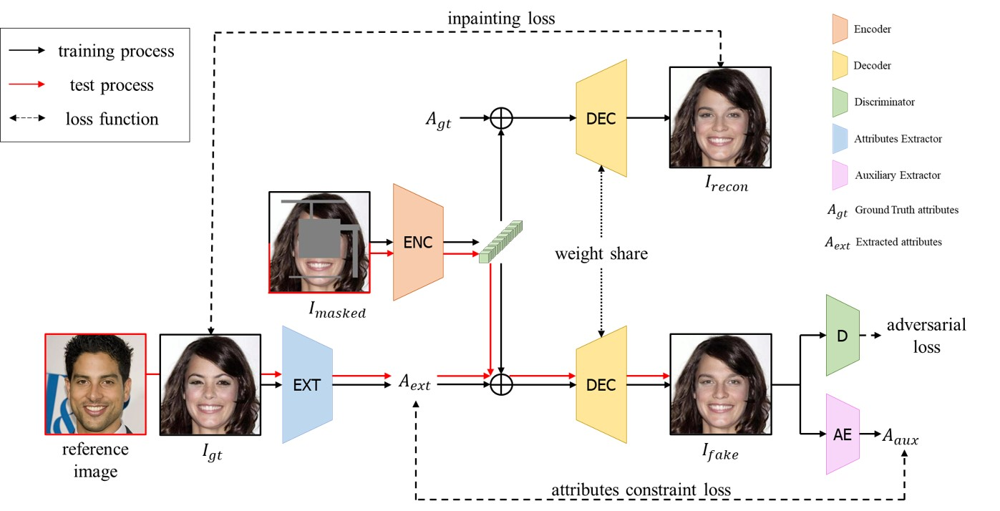

# RGINP: Reference-Guided-Image-Inpainting-using-Facial-Attributes

This repository is a official Pytorch implementation of RGINP.

 

## [Paper](https://arxiv.org/abs/2301.08044)
>**"Reference Guided Image Inpainting using Facial Attributes"**  
>Dongsik Yoon, Jeong-gi Kwak, Yuanming Li, David K Han, Youngsaeng Jin and Hanseok Ko 
>**British Machine Vision Conference (BMVC), 2021**  

## Architecture

$I_{masked}$ and $M$ are the input of $Enc$, we omit $M$ in this figure to express clearly our framework. For the test stage (red line), the user extract desired attributes using our attributes extractor to a reference image.

## Dependencies
- pytorch
- numpy
- Python3
- munch
- Pillow

## **Preparing datasets**

